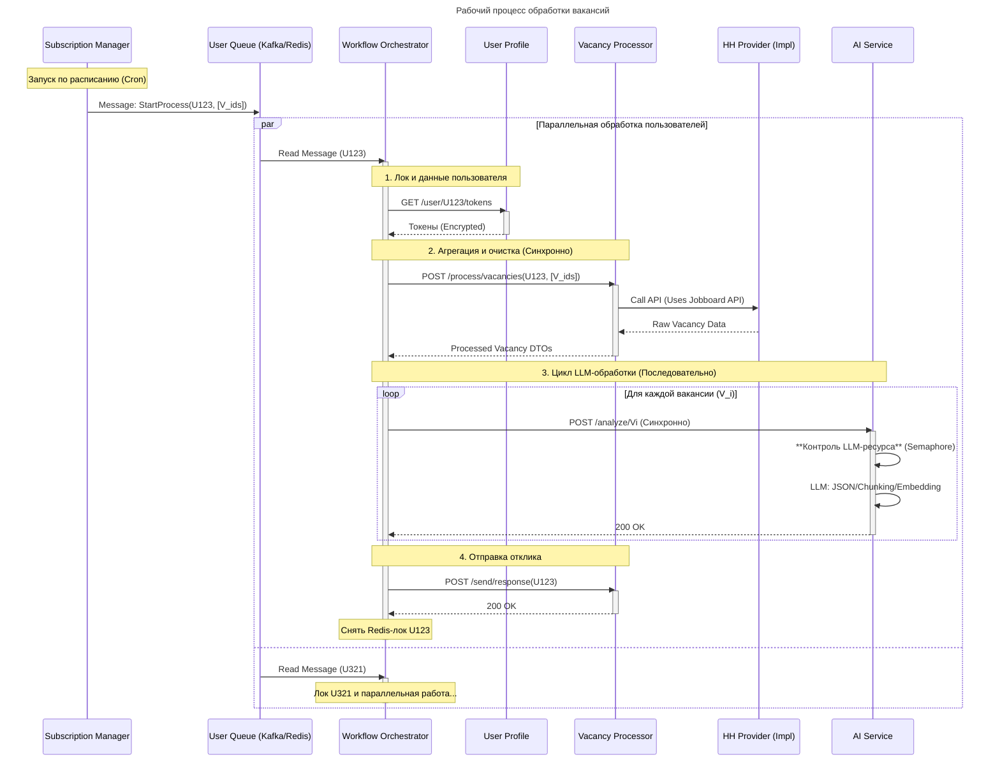

# OClick

Проект разделенный на микросервисы используя gradle модули для автоматизированных откликов с системой плагинов.

## Архитектура

* **buildSrc** - *конвенциональные плагины и общие зависимости для всего проекта*
* **libs** - *библиотеки*
    * `keycloak-provider` - *SPI для брокера сообщений*
    * **provider-contracts** - *API системы плагинов*
        * `jobboard-api` - *API для управления агрегатором вакансий*
        * `llm-api` - *API для выбора llm-backend'а*
        * `vectordb-api` - *API для удобной смены векторной бд*
    * `shared` - *Общие DTO/exceptions/security utils*
* **platform** - *Сервисы связующее платформу (Инфраструктура)*
    * `api-gateway` - *Gateway для обращения сервисов*
    * `config-server` - *Общая конфигурация*
    * `eureka-server` - *Service Discovery*
* **providers** - *Реализации системы плагинов*
    * **jobboards**
        * `hh-provider`
        * `superjob-provider`
    * **llm-backends**
        * `ollama-provider`
    * **vectordb**
        * `qdrant-provider`
* **services** - *Сервисы управления логикой приложения*
    * `ai-service` - *Векторизация чанков, сохранение в VectorDB, создание сопроводительного письма, LLM-анализ.*
    * `user-profile` - *Данные пользователя (токены, вакансии, подписки)*
    * `vacancy-service` - *Получение данных (через Jobboard API), очистка, разделение на чанки, отправка отклика.*
    * `workflow-orchestrator` - *Управляет последовательностью вызовов между другими сервисами (и cron задачей)*
* `shell` - *Подобие frontend'a*

## Key Technologies

* **Backend:** Java 21, Spring Boot, Spring Cloud (Eureka, Gateway)
* **Build Tool:** Gradle with custom convention plugins
* **API Documentation:** OpenAPI (Swagger)
* **Containerization:** Docker
* **AI:** Integrations with LLMs (Ollama) and vector databases (Qdrant)

## Workflow

